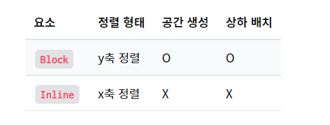

---
# 💻 HTML/CSS 기초
---

▶ **강의일** : 2022년 1월 11일  
▶ **유형** : HTML/CSS  
▶ **주차** : 1주차  
▶ **강의유형** : 온라인  
▶ **학습시간** : 7시간 이상  
▶ **진도율** : 100%  

---
## 📖 요약
---

### ✅ 용어
---
- **`웹 표준`** : 웹 사이트를 작성할 때 따라야 하는 공식 표준이나 기술 규격  
- **`웹 접근성`** : 장애의 여부와 상관 없이 모두가 웹사이트를 이용할 수 있게 하는 방식  
- **`크로스 브라우징`** : 모든 브라우저 또는 기기에서 사이트가 제대로 작동하도록 하는 기법  
- **`
`** : 임의의 공간을 만들 때 사용  
- **`<footer>`** : 가장 하단에 들어가는 정보를 표기할 때 사용  
- **`<article>`** : 문서의 주요 이미지나 텍스트 등의 정보를 담고 구역을 설정하는 태그  
- **`<main>`** : 문서의 주요 내용을 담는 태그  
- **`<nav>`** : 메뉴 버튼을 담는 공간 (navigation)  
- **`Block(<h> or 
)`** vs **`Inline(<a>)`**
    - **`Block`**
        
        ① **`
`** 태그가 대표적이다.
        
        ② 줄바꿈 현상이 나타난다.
        
        ③ width / height 값 사용 가능하다.
        
        ④ margin과 padding 값 사용 가능하다.
        
    
    
    
- **`캐스케이딩`**
    - **`순서에 의한 캐스케이딩`** : 나중에 적용한 속성 값의 우선 순위가 높음.
    - **`디테일에 의한 캐스케이딩`** : 더 구체적으로 작성된 선택자의 우선 순위가 높음.
    - **`선택자에 의한 캐스케이딩`** : style > id > class> type 순 으로 우선 순위가 높음.  
- **`clear`** 속성을 이용하면 **`float`** 속성을 제어할 수 있습니다.
    - **`clear`** 의 속성값 **`both`** 는 **`float: right`** 과 **`float: left`** 두 속성값 모두 제어하겠다는 의미입니다. 따라서 만약 **`float:left`** 만 사용되었다면, **`clear:left`** 를 써도 됩니다.  
- **`*`** 은 모든 태그를 선택하겠다는 의미입니다.