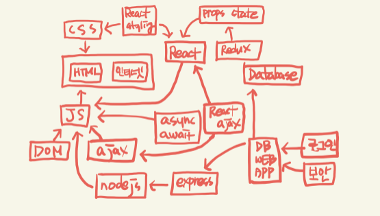

# 실시간 강의

강의일: 2022년 1월 12일
유형: HTML/CSS
주차: 1주차
강의유형: 실시간
학습시간: QR
해결: Yes

# 1/12 정리 내용

---

- `**JS**`와 `**React**`는 꼭 제대로 공부하기
    
    
    
- **tag**
    - `**strong**` : bold 처리
    - `**u**` : 밑줄
- [관련 정보 사이트](https://www.w3schools.com/tags/tag_hn.asp)
- 세계 최초의 사이트 → [http://info.cern.ch/](http://info.cern.ch/)
- **web browser(client) 요청/ web server(server) 응답**
    
    
    
- **비쥬얼 스튜디오**
    - 보기 → 명령 팔레트 → 약어로 래핑 → 단축키 설정(`**ctrl + shift + alt + .**`)
    - 보기 → 명령 팔레트 → next edit point → 단축키 설정(`**ctrl +shift + alt + ,**`)
    - 보기 → 명령 팔레트 → save all files → 단축키 설정(**`ctrl+alt+s`**)
    - li*3
    - 왼쪽 메뉴 → 확장 → `**live server**` 설치
    - lorem : 샘플 텍스트(영어) → 한글은 lorem Ipsum
    - .notice p <-- notice 안에 있는 모든 p에 해당
    .notice > p <-- notice의 자식인 p에만 해당!