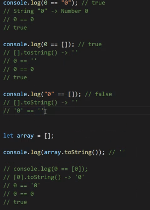

---
# 👉 실시간 강의
---

▶ **강의일** : 2022년 1월 21일  
▶ **유형** : JavaScript  
▶ **주차** : 2주차  
▶ **강의유형** : 실시간  
▶ **학습시간** : QR     

---
## 📖 요약
---

- **`var`**  vs **`let`** vs **`const`**
    - **var** : 재 변수 선언이 가능하다.
    - **let** : 재 변수 선언 불가능/ 단, 변수내용 변경은 가능 ⇒ 가변성
    - **const** : 한 번 선언 하면 불변  
- 연산할 때, 모든 숫자는 문자열로 바꿀 수 있지만, 모든 문자열을 숫자로 바꾸진 못함  
- +를 제외한 연산기호는 ‘문자형 숫자’ → ‘숫자’  
- **형변환 관련 `True/False`**
    
    
    
- **forEach 함수 예시 (students는 객체상태)**
    
    